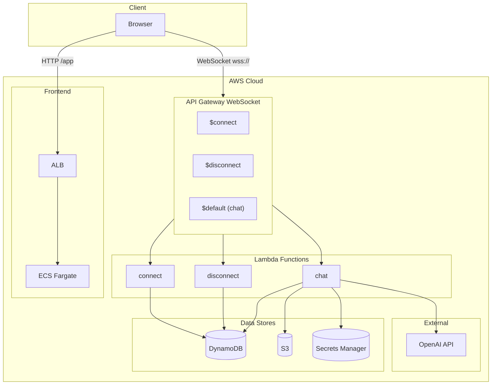
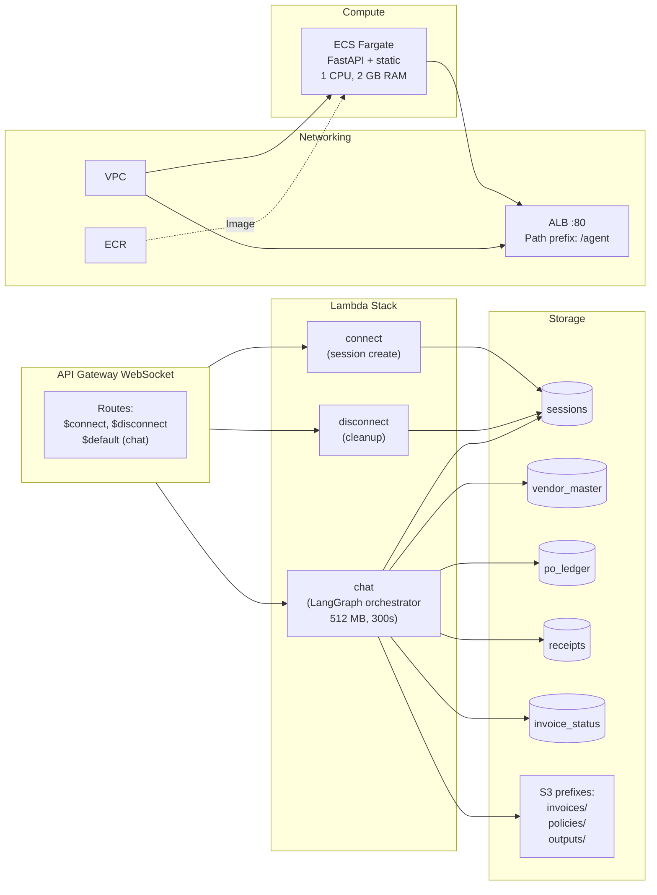
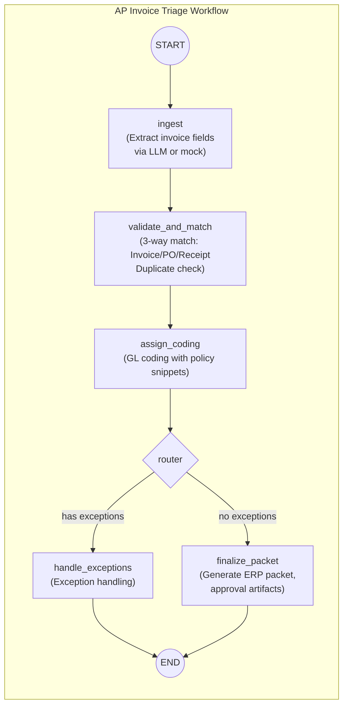
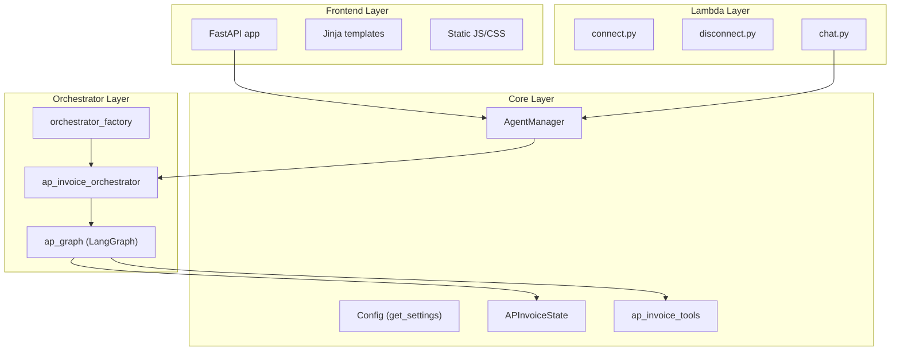
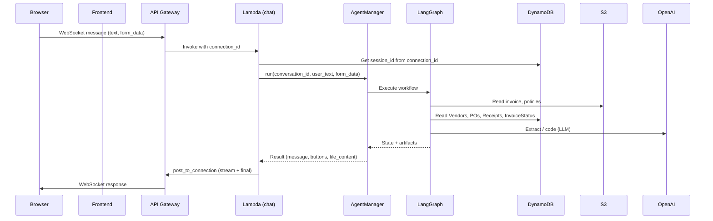
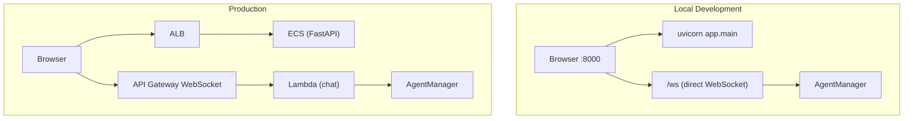

# AP Invoice Triage + Coding Copilot — Architecture

## 1. High-Level System Architecture

## 2. Infrastructure Component Detail

## 3. LangGraph Workflow (AP Orchestrator)

## 4. Application Layer Stack

## 5. Data Flow (Chat Message Path)

## 6. Local Development vs Production

---

## Key Configuration

| Variable | Purpose |
|----------|---------|
| `ORCHESTRATOR_TYPE` | `ap` or `langraph` (both use LangGraph workflow) |
| `AGENT_WS_URL` | WebSocket URL for frontend (prod: API Gateway; local: ws://localhost:8000/ws) |
| `S3_AP_BUCKET` | S3 bucket for invoices/, policies/, outputs/ |
| `OPENAI_API_KEY` | From env (local) or Secrets Manager (Lambda) |
